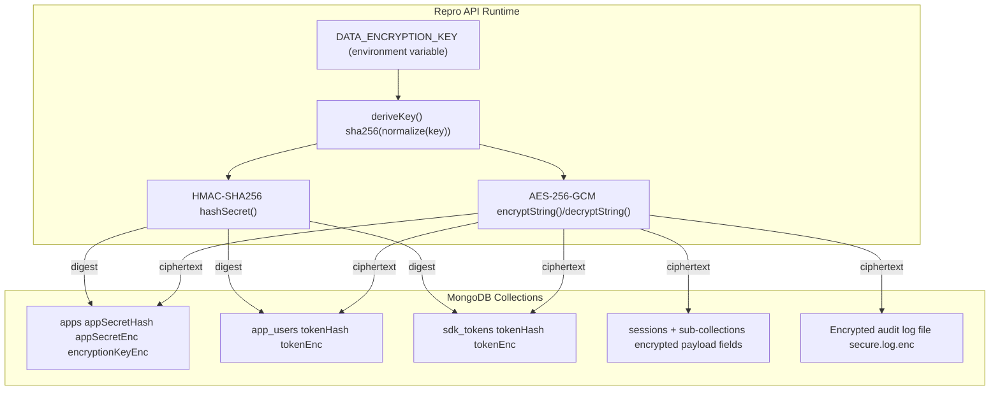

# Repro API

This service powers multi-tenant session capture and analytics for the Repro platform. The API now enforces strict tenant isolation, encrypts sensitive data both in transit and at rest, and requires clients to identify themselves with tenant-aware credentials on every request.

## Key Capabilities

- **Tenant isolation** – every document stored in MongoDB is tagged with a `tenantId`. Guards resolve the tenant from request headers and the `TenantContext` wiring ensures services never have to pass tenant identifiers by hand.
- **Encrypted secrets** – app secrets, SDK tokens, and app user tokens are persisted as HMAC digests plus AES-256-GCM ciphertext. Log files are written with the same cipher (
  see `common/security/secure-logger.ts`).
- **TLS everywhere** – the Nest HTTP server can terminate TLS and the MongoDB driver negotiates TLS connections by default. Plain HTTP and non-TLS drivers are supported for local development but not recommended for production.
## Encryption Architecture

Repro uses a single symmetric master key to protect tenant credentials, SDK tokens, session payloads, and secure audit logs. The key is supplied via `DATA_ENCRYPTION_KEY`, normalized to 32 bytes, and cached in process memory (`src/common/security/encryption.util.ts`). AES-256-GCM provides confidentiality and integrity, while HMAC-SHA256 enables constant-time secret lookups. When `APP_ENCRYPTION_DISABLED=1`, the API skips AES/HMAC entirely so secrets and payloads are stored in plaintext for easier local debugging (existing encrypted values remain readable if `DATA_ENCRYPTION_KEY` is still provided).



### Key Derivation
- `DATA_ENCRYPTION_KEY` accepts raw, hex, or base64 encodings; the service rejects startup if it is missing unless `APP_ENCRYPTION_DISABLED=1` (`src/common/security/encryption.util.ts:17`).
- `deriveKey()` squeezes the input to 32 bytes with SHA-256 and caches the result per process.

### Secret & Token Storage
- `apps` collection stores both `appSecretHash` (HMAC) and `appSecretEnc` (AES), along with a per-tenant `encryptionKeyEnc` used by clients (`src/apps/apps.service.ts:42`).
- `app_users` and `sdk_tokens` store their credential digests and ciphertext, allowing authentication with hashes while retaining recoverable plaintext when required (`src/apps/app-users.service.ts:94`, `src/sdk/sdk.service.ts:26`).

### Session Data Protection
- Request/response metadata, headers, bodies, email payloads, database diffs, and other sensitive traces are wrapped with `encryptField()` before persistence (`src/sessions/sessions.service.ts:168`, `src/sessions/utils/session-data-crypto.ts:6`).
- Hydrator helpers reverse the process when documents are read, tolerating legacy or malformed records gracefully.

### Secure Audit Logging
- `createSecureLogger()` encrypts JSON log entries line-by-line before writing to disk, ensuring operational telemetry cannot leak secrets (`src/common/security/secure-logger.ts`).

### Benefits
- Protects user credentials and tenant keys even if MongoDB is exfiltrated; attackers need both ciphertext and the environment master key.
- Prevents tampering—GCM authentication tags cause decryption failures if data is modified.
- Limits insider access by hiding PII within session payloads and email captures.
- Ensures sensitive diagnostics remain private while still available for authorized troubleshooting.

## Environment Variables

| Variable | Required | Description |
| --- | --- | --- |
| `DATA_ENCRYPTION_KEY` | ✅ (unless `APP_ENCRYPTION_DISABLED=1`) | 32-byte secret (raw, hex, or base64). Used to derive symmetric keys for encrypting app secrets, tokens, and log files. |
| `APP_ENCRYPTION_DISABLED` | Optional | Set to `1`, `true`, or `yes` to bypass all application-level encryption/HMAC logic. New secrets are saved in plaintext; existing encrypted values still decrypt if `DATA_ENCRYPTION_KEY` is present. |
| `MONGO_URI` | ✅ | Mongo connection string with database name (e.g. `mongodb+srv://.../repro`). |
| `MONGO_TLS` | Optional (default `true`) | Set to `false` to disable driver TLS in development. |
| `MONGO_TLS_CA` | Optional | Path to a CA bundle used when `MONGO_TLS` is enabled. |
| `MONGO_TLS_ALLOW_INVALID_CERTS` | Optional | Set to `true` when using self-signed certificates in non-production environments. |
| `TLS_KEY_PATH` / `TLS_CERT_PATH` | Optional | When both are supplied, Nest will boot in HTTPS mode using the provided PEM files. |
| `TLS_CA_PATH` | Optional | Additional CA bundle for HTTPS clients. |
| `SECURE_LOG_DIR` / `SECURE_LOG_FILE` | Optional | Override the default location (`logs/secure.log.enc`) for AES-encrypted audit logs. |

## Request Headers

All requests that interact with tenant data must include `X-Tenant-Id`. Other guards continue to enforce the existing headers (`Authorization`, `X-App-Id`, `X-App-Secret`, `X-App-User-Token`, etc.).

```
X-Tenant-Id: TENANT_...
Authorization: Bearer <sdk-token>
X-App-User-Token: <workspace password>
```

Admin operations now rely on the same workspace credential flow: supply the admin user's `X-App-User-Token` (the generated password) together with `X-Tenant-Id` to manage apps, rotate keys, and invite teammates.

## Client Registration Flow

1. `POST /init` provisions a new tenant using `{ email, appName?, password }`. The response includes:
   - `tenantId`
   - `appSecret` (plain text, returned once)
   - `encryptionKey` (per-tenant data key managed by the API)
   - An initial admin user that reuses the password you supplied (or a generated one when omitted)
2. The tenant id must be stored by the client and attached to every future Repro SDK call via the `X-Tenant-Id` header.

## Data Storage Changes

- **Apps (`apps` collection)**: now contain `tenantId`, `appSecretHash`, `appSecretEnc`, and `encryptionKeyEnc` fields.
- **App Users (`app_users`)**: new `tenantId`, `tokenHash`, and `tokenEnc` fields. Existing tokens must be reset (the API re-encrypts new ones automatically).
- **Sessions & Observability**: all session-related collections include `tenantId` and their indexes were updated to scope uniqueness to the tenant.
- **SDK Tokens**: persisted as `(tenantId, appId, tokenHash, tokenEnc)`.

Indexes were updated to include `tenantId`. Allow MongoDB to rebuild background indexes after deploying these changes.

## TLS Configuration

When `TLS_KEY_PATH` and `TLS_CERT_PATH` are set, the API serves HTTPS traffic. For local testing, you can generate a self-signed cert:

```bash
openssl req -x509 -nodes -newkey rsa:4096 \
  -keyout ./certs/api-key.pem \
  -out ./certs/api-cert.pem \
  -days 365 \
  -subj "/CN=localhost"

export TLS_KEY_PATH=./certs/api-key.pem
export TLS_CERT_PATH=./certs/api-cert.pem
export MONGO_TLS=false # if using a local Mongo without TLS
npm run start:dev
```

## Development Notes

- `TenantContext` (request scoped) resolves the tenant id once and makes it available everywhere via dependency injection. Avoid threading tenant ids through method parameters.
- Guards (`AppSecretGuard`, `SdkTokenGuard`, `AppUserTokenGuard`) verify both the credential and the tenant id before populating the request context.
- Logs written through `createSecureLogger()` are AES-encrypted line-by-line. Enable the logger by default via `main.ts`.

## Running Locally

```bash
cp .env.example .env
echo "DATA_ENCRYPTION_KEY=$(openssl rand -base64 32)" >> .env
echo "MONGO_URI=mongodb://localhost:27017/repro" >> .env

# optional dev shortcuts
echo "MONGO_TLS=false" >> .env

npm install
npm run start:dev
```

Ensure your SDKs (React, Nest, Node) attach the tenant header – refer to their READMEs for configuration details.
